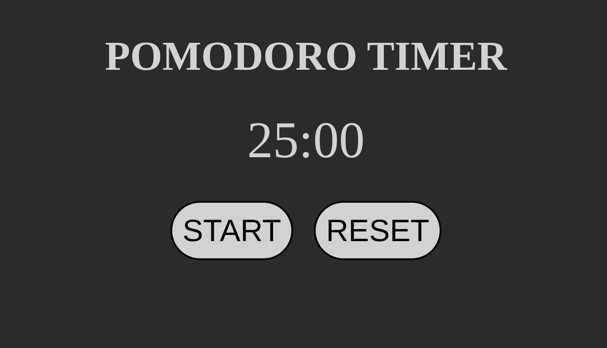

# 🍅 Pomodoro Timer

A minimal, vanilla JavaScript Pomodoro timer. Start a classic 25-minute work session and watch it count down — no frameworks, no build step, no dependencies.

## ✨ Features

- ⏱️ Classic 25-minute Pomodoro work session
- ▶️ Start / ↺ Reset with a single click
- ⏰ Drift-free timekeeping — the countdown is computed from the wall clock (`Date.now()`), so it never loses or gains a second
- 🔁 Auto-reset at the end of a session — the timer returns to IDLE, ready for the next round
- 🧩 Clean 3-layer architecture: logic / rendering / orchestration
- 🎨 Minimal dark UI, pure CSS custom properties

## 🧱 Tech Stack

- **HTML5 + CSS3** — custom properties, flexbox
- **Vanilla JavaScript** — ES modules

## 📁 Project Structure

```
Pomodoro Timer/
├── index.html          → the skeleton (the structure)
├── style.css           → the presentation (the look)
└── scripts/
    ├── timer.js        → logic layer (the clock: a small state machine, DOM-free)
    ├── render.js       → UI layer (writes only to the DOM)
    └── app.js          → orchestration (event listeners, glues the two)
```

## ⚙️ How It Works

1. You press **START**: `app.js` tells `timer.js` to run, and `render.js` starts its single 1-second loop (created exactly once, at app startup).
2. Every second, `render.js` asks `timer.js` for the remaining time via `tick()`.
3. `timer.js` computes the remaining time from the wall clock (`endTime - Date.now()`), so the countdown never drifts, no matter how busy the machine is.
4. When the counter hits zero the state becomes `FINISH`; the timer auto-resets to IDLE, ready for the next **START**.
5. **RESET** cancels the session and brings the display straight back to `25:00`.



## 📄 License

Made by Daniele. Free to use, modify and share. 🚀